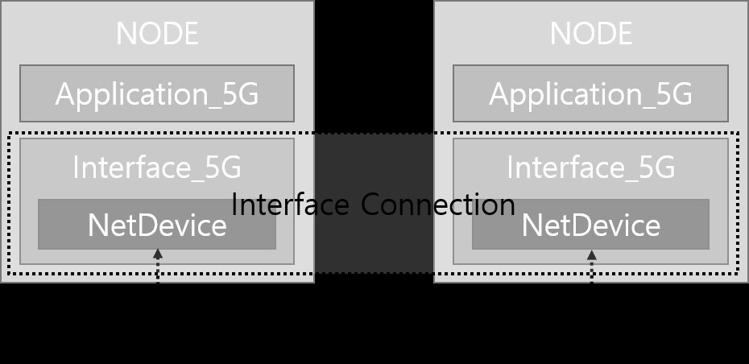
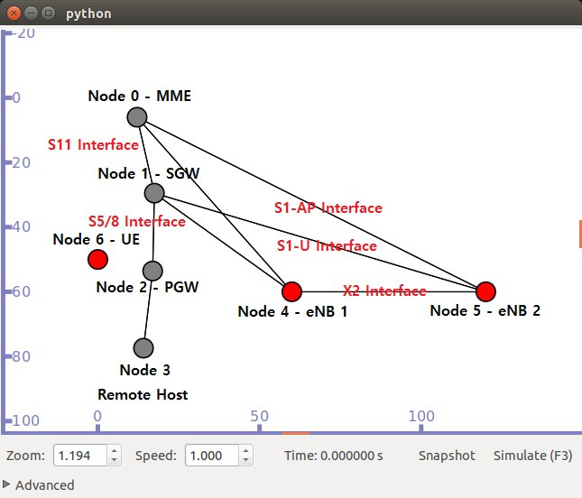
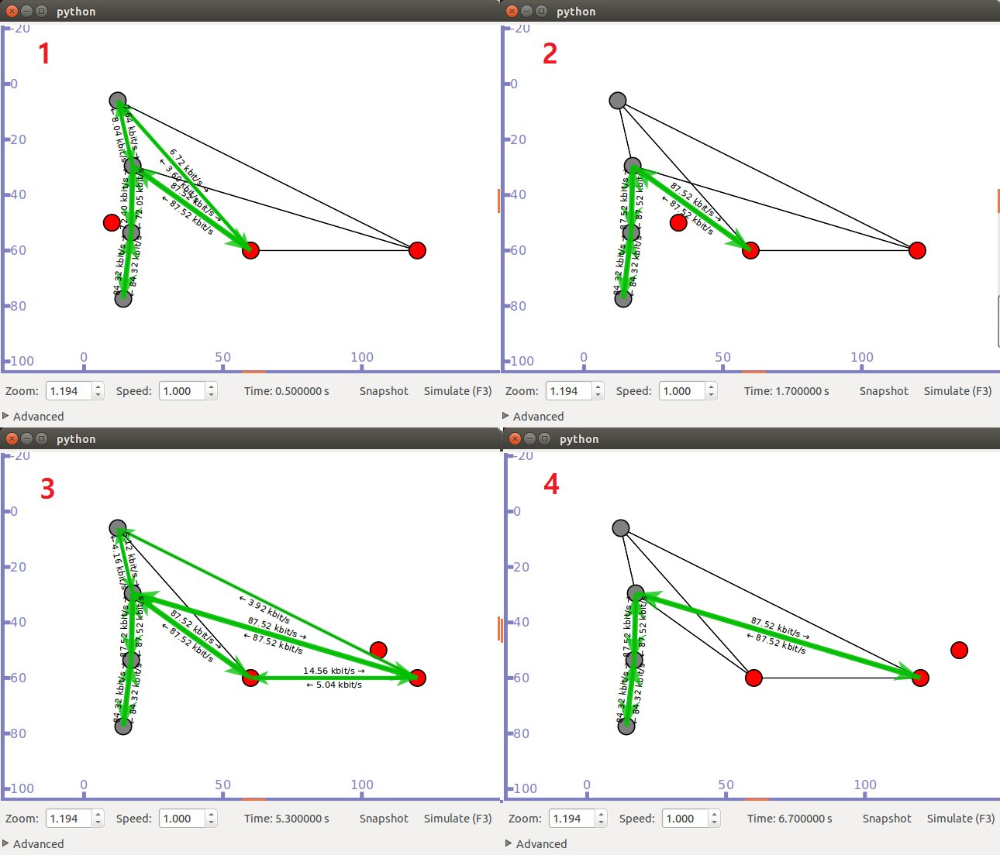
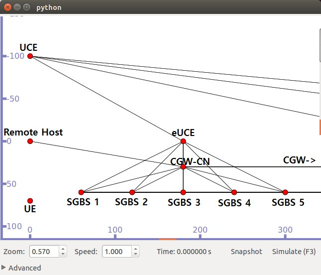
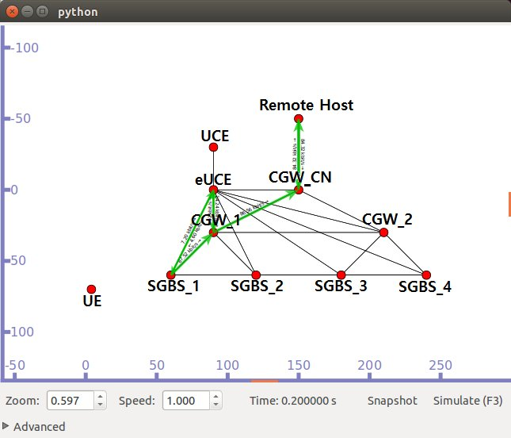
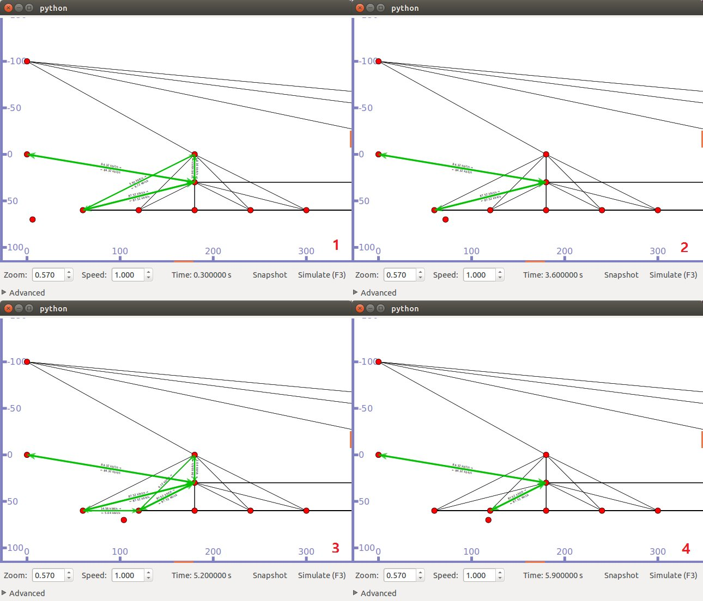
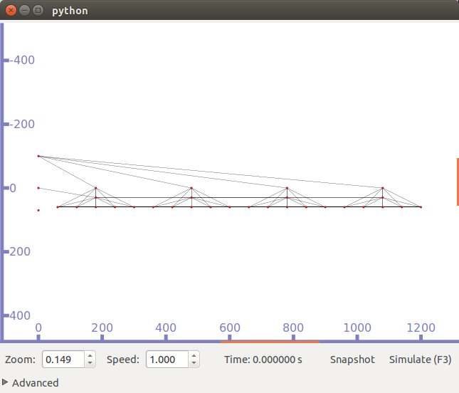
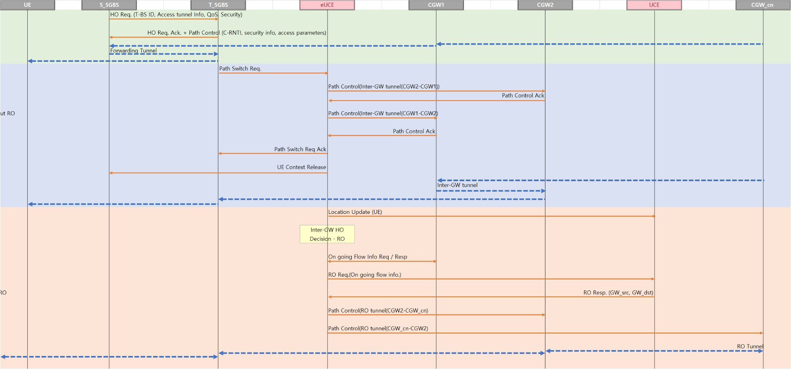

# 5G Network Simulator (2016. 04)

NS-3 기반 5G 네트워크 시뮬레이터

> 인제대학교 차세대 네트워크 연구실 & ETRI (한국전자통신연구원)

---

## ⚠️ Notice

**본 프로젝트의 소스 코드는 공개되지 않습니다.**

본 시뮬레이터는 ETRI(한국전자통신연구원)와의 협력 연구 과제로 개발되었으며, 지적재산권 및 계약상의 이유로 소스 코드 제공이 불가합니다. 양해 부탁드립니다.

---

## 개요

본 시뮬레이터는 NS-3.23을 기반으로 제작된 5G 네트워크 시뮬레이션 모듈입니다. 4G/5G 환경에서의 Initial Attach, 핸드오버 등을 시뮬레이션할 수 있습니다.

## 시스템 요구사항

| 항목 | 요구사항 |
|------|---------|
| OS | Linux Ubuntu 12.04 LTS |
| NS-3 | ns-allinone-3.23 |
| 컴파일러 | gcc, g++ |
| 기타 | Python, Qt4, Mercurial, Bazaar |

## 모듈 구조

```
src/
├── 4g/          # LTE 모듈 재구성, Application_5G, Interface_5G 포함
├── cnc-module/  # 시뮬레이션 유틸리티 기능
├── etri/        # ETRI 5G 관련 코드
└── lte/         # 기존 NS-3 LTE 모듈
```

---

## 시뮬레이터 구조



시뮬레이터는 `Application_5G`와 `Interface_5G` 클래스를 중심으로 구성됩니다.

- **Interface_5G**: 컨트롤 메시지를 교환
- **Application_5G**: 유저 메시지와 기본 P2P 메시지를 교환

---

## 4G 시뮬레이션

### 4G 기본 구성



TestCase1(TC1)을 나타낸 것으로 eNB 개수와 UE 개수를 수정할 수 있습니다.

### 4G 시그널링 - Initial Attach(1\~2), 핸드오버(3\~4)



4G 상에서 Initial Attach와 핸드오버의 절차를 보여줍니다.
- **1\~2번**: Initial Attach
- **3\~4번**: 핸드오버 과정

---

## 5G 시뮬레이션

### 5G 기본 구성



5G의 기본 구성입니다. CN은 제일 처음 등록되는 CGW로 등록되며, 모든 UE들은 이 CGW를 CN으로 설정하게 됩니다.

### 5G Initial Attach



5G에서의 Initial Attach 과정입니다.

### 5G Inter-GW 핸드오버



5G 상에서 Initial Attach(1\~2)와 Inter-GW HO(3\~4)를 나타낸 그림입니다.

### Inter-GW HO - RO 오버뷰



Inter-GW HO와 RO(Route Optimization) 전체 시나리오의 연결 상태를 보여줍니다.

### LTE RO vs 5G RO 시퀀스 비교



LTE와 5G의 RO 시퀀스를 비교한 다이어그램입니다.

---

## 예제 프로그램

| 파일명 | 설명 |
|--------|------|
| `TestCase1.cc` | 4G 기반의 Initial Attach를 수행 |
| `TestCase1-2.cc` | 4G 기반의 Initial Attach 및 X2 핸드오버를 수행 |
| `TestCase2.cc` | 4G 기반에서 PSGW를 사용한 Initial Attach를 수행 |
| `TestCase2-2.cc` | 4G 기반에서 PSGW를 사용한 Initial Attach 및 X2 핸드오버를 수행 |
| `TestCase3.cc` | 5G 기반에서 Initial Attach를 수행 |
| `TestCase3-2.cc` | 5G 기반에서 Initial Attach 및 RO 핸드오버를 수행 |
| `TestCase4-1.cc` | PSGW 기반으로 Data Path Length를 측정 |
| `TestCase4-2.cc` | CGW 기반으로 Data Path Length를 측정 |

## 설정 파라미터

| 파라미터 | 설명 |
|---------|------|
| `numberOfUes` | UE의 수 |
| `numberOfEnbs` | eNB의 수 |
| `distance` | Mobility가 주어진 노드들이 떨어져있는 기본적인 거리 |
| `yForUe` | UE의 y 포지션 값 |
| `speed` | Mobility가 적용된 UE의 이동 속력 |
| `simTime` | Visualizer가 적용되지 않은 상태의 시뮬레이션 시간 |
| `enbTxPowerDbm` | eNB의 TxPower |
| `interPacketInterval` | 각 종단 노드로부터 패킷이 만들어지는 주기 |

## 출력 파일

| 파일 | 설명 |
|------|------|
| `CNCAll.csv` | Control Flow에 대한 로그 |
| `*.pcap` | 각 채널에서 이동한 패킷들을 캡쳐한 파일 |
| `DataPath4G(PSGW).csv` | 4G 데이터 경로 측정 결과 |
| `DataPath5G(CGW*).csv` | 5G 데이터 경로 측정 결과 |

---

## 참고 자료

- [NS-3 공식 홈페이지](http://www.nsnam.org/)
- [NS-3 오픈 소스](http://code.nsnam.org/)
- [NS-3 유저 커뮤니티](https://groups.google.com/forum/#!forum/ns-3-users)

---

*인제대학교 차세대 네트워크 연구실 · ETRI*

*2016. 04*